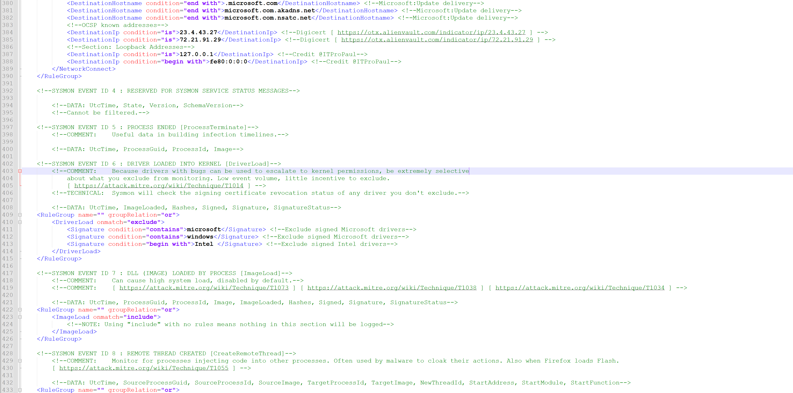
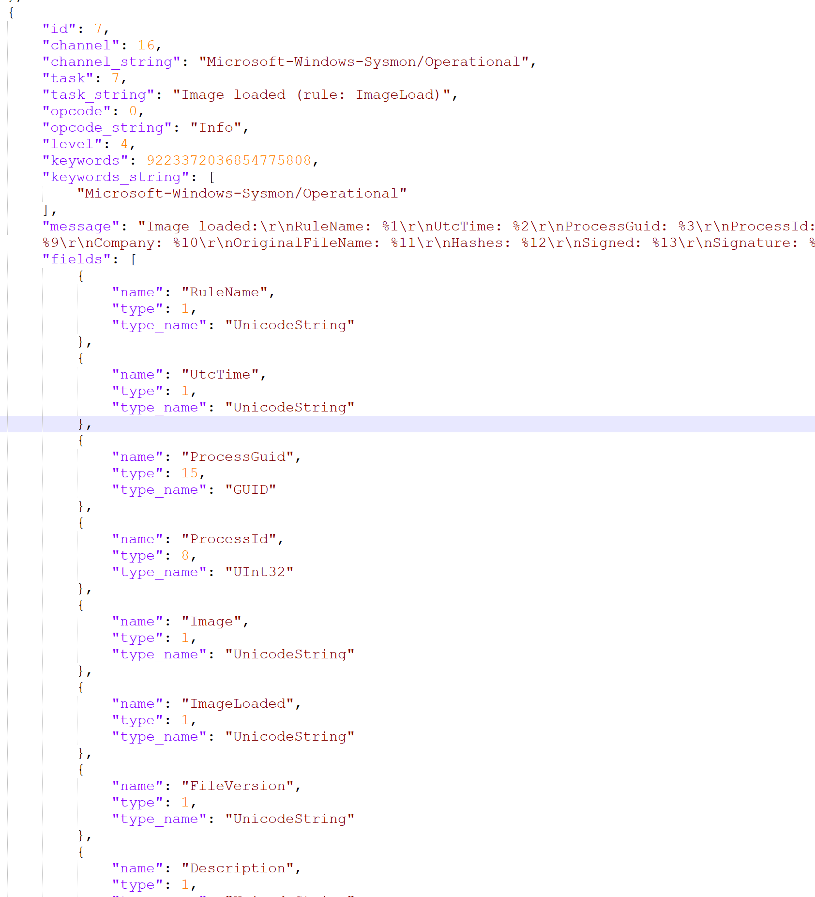
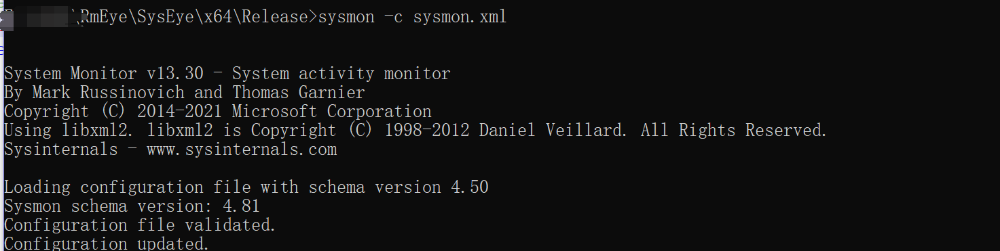
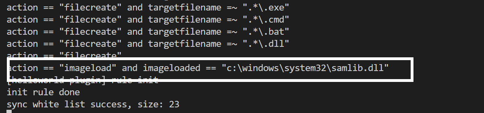
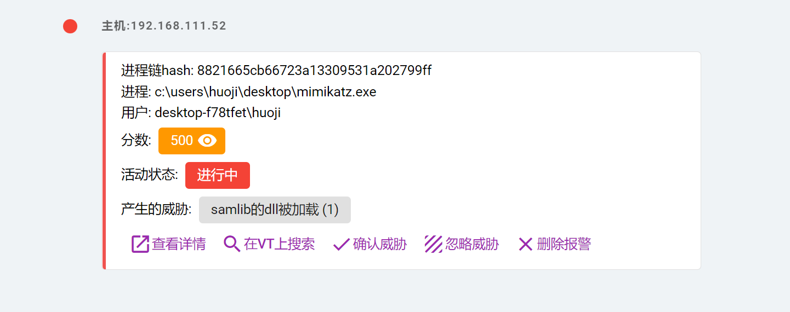

### 规则编写教程

首先明确一点,rmeye有绝大部分威胁的检出能力,但是受限于规则,这些能力相当于只记录但是没生效.因此编写规则是一件重要的事情.在一切的开始,请您阅读ATT&CK的思想:  

https://key08.com/index.php/2022/08/09/1505.html  

本文以检测`mimikatz的关键dll加载`为例  

`mimikatz`会加载: `C:\\Windows\\System32\\samlib.dll` 本文以他为例  

### sysmon客户端规则

在编写服务端规则之前,请确保`sysmon`有相关配置.因为`rmeye`依赖于`sysmon`,得有客户端规则,才有服务端规则:  

打开客户端安装目录下的`sysmon.xml`:  



我们需要检测`dll`加载,所以请把目光看到`ImageLoad`

其他的`sysmon`字段请自行谷歌或者百度了解.本项目有个`provider.json`那个是`sysmon`的所有字段.可以参考,打开`provider.json` ,找到`ImageLoad`



可以看到`sysmon`记录了非常多有用的字段,对于我们来说,我们只需要`ImageLoaded`

在`sysmon.xml`找到`Imageload`这个block,

```c
	<RuleGroup name="" groupRelation="or">
		<ImageLoad onmatch="include">
			<!--NOTE: Using "include" with no rules means nothing in this section will be logged-->
		</ImageLoad>
	</RuleGroup>
```

我们给他增加一个,接受加载`C:\\Windows\\System32\\samlib.dll`的日志:

```c
	<RuleGroup name="" groupRelation="or">
		<ImageLoad onmatch="include">
			<ImageLoaded condition="is">C:\Windows\System32\samlib.dll</ImageLoaded>
		</ImageLoad>
	</RuleGroup>
```


保存,更新`sysmon`的配置文件,在`rmeye`的安装目录或者在`sysmon`的安装目录执行:

```
sysmon -c sysmon.xml
```



看到这个,说明你成功了,其他的说明规则有错误,检查一下你写的规则.


### 服务端规则编写

客户端有了搜集日志能力后,是时候编写服务端的了:

打开服务端目录下的`server/rules/action.py`

在末尾添加:

```
    {
        'rules': [
            'action == "imageload" and imageloaded == "c:\\windows\\system32\\samlib.dll"',
        ],
        'score': 50,
        'name': 'samlib的dll被加载'
    }
```

其中

```
rules: 规则的列表,可以是多个规则,是and关系
score: 是分数,跟config.py里面的报警分数有关系
name: 规则名字
规则全部小写,==代表正常匹配,如果是=~代表使用python正则
```

保存,重启服务端,如果不出意外您应该看得到最新的刚刚增加的规则:




### 测试

找个mimikatz运行一下看看:



(为了测试,将分数设置高一点准没错)

至此,您就具备的检测mimikatz的一些行为的能力,当然这行为是不全的而且容易产生很多误报的,很多时候为了减少误报或者实现更精准的检测,您需要高级检出能力,这将在下一章插件检测中介绍.